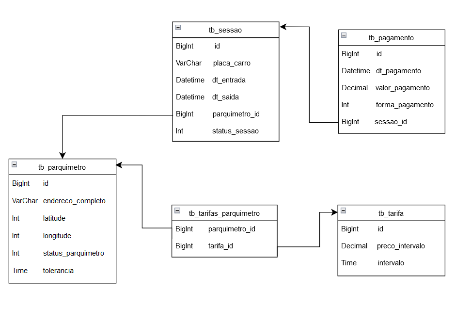

# Tech Challenge 02 - Parquímetro

- [Introdução](#introdução)
- [Funções](#funções)
- [Tecnologias](#tecnologias)
- [Instalação](#instalação)
- [Banco de dados](#bancodedados)
- [API](#api)

***

## Introdução

Esta aplicação é um sistema de gerenciamento e controle de parquímetros desenvolvido com o framework Springboot. Através dela se pode cadastrar parquímetros com tarifas diferentes, gerenciar a sessão de veículos e calcular o valor a ser cobrado. 

***

## Funções

* Cadastrar parquímetros diferentes.
* Definir taxas por período de tempo para cada parquímetro. 
* Registrar e gerenciar a sessão de veículos em cada parquímetro
* Calcular o valor a ser pago conforme a tarifa estipulada e o tempo da sessão.
* Verificação de pagamento para encerrar a sessão.

***

## Tecnologias

* Springboot: Framework web
* Gradle: Gerenciador de dependências
* Swagger: Documentação e interface para testes
* H2: Banco de dados em memória

***

## Instalação

* Instalar Java 23 e o Gradle. 
* Baixe os arquivos repositório. `https://github.com/joao-v170r/tech-challenge-02`.
* Entre na pasta do repositório. `cd tech-challenge-02`.
* Execute o projeto com Gradle.
  * Utilize este comando no terminal: `./gradlew bootRun`.
  * No Windows, caso esteja utilizando CMD, use: `gradlew.bat bootRun`.
 
O Swagger pode ser acessado diretamente em `http://localhost:8080/swagger-ui/index.html`. 

Por padrão o banco de dados em memória já possuirá um parquímetro e duas tarifas cadastradas.

***

## Banco de dados

    

***

***

## API

***
